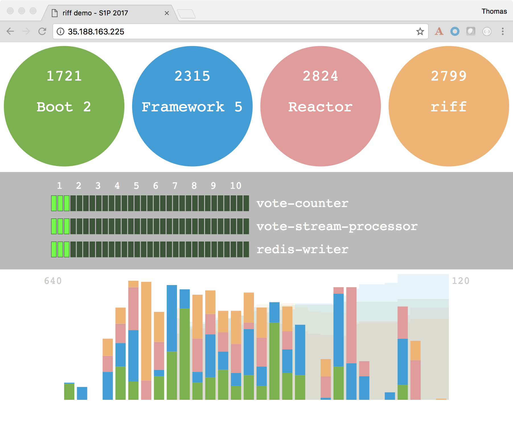

# Spring One 2017 demo of vote counting using riff

This demo consists of three functions and a UI to collect votes and display the results.



The vote bubbles on the top of the UI page collects votes and posts them via the HTTP gateway to the _votes_ topic.
The votes are processed by the `vote-counter` function and written to Redis.
The `vote-stream-processor` also reads the _votes_ topic and processes the stream of votes with two windowing operations.
One window for counts every two seconds and one for counts every 60 seconds.
The results are written to a _function-replicas_ topic read by the `redis-writer` function which writes the results to Redis.
The UI then collects the windowing results and shows it at the bottom of the page.

## Running the Demo on Minikube

### build the components

```
eval $(minikube docker-env)
 
pushd functions/vote-stream-processor ; ./mvnw -DskipTests clean package ; popd

riff build -f functions/vote-counter/ -v 0.1.0 -u projectriff
riff build -f functions/redis-writer/ -v 0.1.0 -u projectriff
riff build -f functions/vote-stream-processor/ -v 0.1.0 -u projectriff

docker build -t projectriff/riff-demo-ui:0.1.0 ui
```

### install riff

```
helm init
kubectl create namespace riff-system
helm install --name transport --namespace riff-system projectriff/kafka
helm install --name control --namespace riff-system projectriff/riff --devel --set rbac.create=false --set httpGateway.service.type=NodePort
```

### install redis

```
helm install -n counters stable/redis --set serviceType=NodePort --set persistence.enabled=false
```

### deploy functions

```
riff apply -f functions/vote-counter/
riff apply -f functions/redis-writer/
riff apply -f functions/vote-stream-processor/
```

### deploy UI

```
kubectl apply -f ui/minikube/ui-service.yaml
kubectl apply -f ui/minikube/ui-deployment.yaml
```

### play with the votes

```
minikube service votes-ui
```

## Running the Demo on GKE with RBAC

### install riff

```
kubectl -n kube-system create serviceaccount tiller
kubectl create clusterrolebinding tiller --clusterrole cluster-admin --serviceaccount=kube-system:tiller
helm init --service-account=tiller
kubectl create namespace riff-system
helm install --name transport --namespace riff-system projectriff/kafka
helm install --name control --namespace riff-system projectriff/riff --devel
```

### install redis

```
helm install -n counters stable/redis --set persistence.enabled=false
```

### deploy functions

```
riff apply -f functions/vote-counter/
riff apply -f functions/redis-writer/
riff apply -f functions/vote-stream-processor/
```

### deploy UI

```
kubectl apply -f ui/gke-rbac/ui-rbac.yaml
kubectl apply -f ui/gke-rbac/ui-service.yaml
kubectl apply -f ui/gke-rbac/ui-deployment.yaml
```

### play with the votes

Look for the External ip address using:
```
kubectl get svc votes-ui
```

Paste that ip address into a browser address bar.

## Tear down the Demo

### delete functions

```
riff delete -f functions/vote-counter/ --all
riff delete -f functions/redis-writer/ --all
riff delete -f functions/vote-stream-processor/ 
```

### delete UI

Delete deployment and service:

```
kubectl delete deployment votes-ui
kubectl delete service votes-ui
```

If you are running on RBAC enabled GKE cluster also delete the service account and role binding:

```
kubectl delete rolebinding votes-ui
kubectl delete serviceaccount votes-ui
kubectl delete role votes-ui
```

### delete redis

```
helm delete counters --purge
```

### delete riff

```
helm delete control --purge
helm delete transport --purge
```
